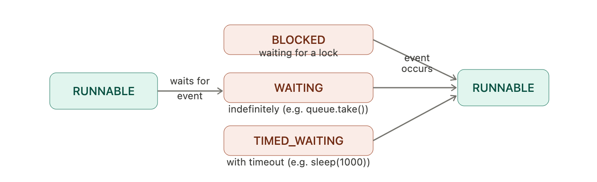

# Chapter 4: Building Blocks

### Synchronized Collections 
1. These collections are thread safe but we may need to use client-side locking for additional functionalities which involves check-and-act. This can give inconsistent results. Even if we lock the operations the other threads would wait for longer duration in order to get the lock released. 
2. One way is to create a copy of the collection and let the thread do iteration on it, this way the main collection will be accessible by other threads. 
3. While using iterator on synchronized collection (fail-fast, as they throw exception as soon as modCount or modification count changes), it can throw `ConcurrentModificationException` even with iterator if multiple threads try to modify it. Hence, external synchronization is needed here too.
4. If you want concurrent modification, you may use fail-safe collections. (As they work on copy of collection, they will be thread safe but with trade off being weakly consistent). 

--- 

### Concurrent Collections
1. With synchronized collections, throughput suffers when multiple threads contend for the collection-wide lock. 
2. We have concurrent collections like `ConcurrentHashMap` & `CopyOnWriteArrayList` (use in High Read, Less Write) which allows concurrent access with a cost of weak consistency.
3. Normal `Queue` is not thread safe and can't be used when multiple thread access it. For that we have `ConcurrentLinkedQueue` & `BlockingQueue` (the multithreading superstar :) 
* **ConcurrentLinkedQueue**: fail-safe, under the hood uses CPU level CAS operations rather than manual locks. It's **non-blocking**, it means when queue is empty it does not wait for an item to arrive, instead returns null.
* In `ConcurrentHashMap` we don't get consistent results for operations like `size` & `isEmpty`, also in concurrent environment we don't often need these operations as these are moving targets getting accessed by multiple threads. 
* Before Java8, `ConcurrentHashMap` was working using `Lock-Stripping` (segment level lock, segment are lesser than buckets)which is segment level lock, from Java8 onwards it uses `Node-Level Locking` (close to bucket level lock). 

--- 

### Blocking Queues 
* **BlockingQueue**: Ultimate solution for **_Producer-Consumer_** problem because of its blocking nature. `put(item)` adds an items and blocks thread when queue is full, will wait till there is space available for new item. `take()` grabs item out of queue, will block the thread until there is item available to grab i.e will block thread when there is no item in queue.
* These queues can be bounded and unbounded. 
* Famous Producer-Consumer design is `ThreadPool` coupled with a work queue. 
* _What if Producer produces item at a faster rate than consumer consumes_? This can lead to Memory Overflow, for this simply use a `bounded queue` as per consumer's consumption. This way the producer thread will block and won't keep on adding items indefinitely. 
* **BlockingDeque**: Used for `work stealing` algo, where consumers have their own queue. If a consumer completes all its tasks, it can steal new task from other consumer's tail queue. **ForkJoinPool also uses a work-stealing algorithm.**

--- 

### Blocking & Interruptible Methods 

* Thread may get `block` or pause due to I/0, timed wait for waiting for lock to acquire. It needs to wait till the operations gets completed. 
* `InterruptedException` is used on method for the method which involves thread blocking. For eg: `put` & `take` methods of `BlockingQueue`. 
* Each thread can be interrupted with it's method `interrupt`. But its co-operative mecahnism i.e threadA can't force threadB to stop, it gently asks to stop whatever task it's doing as per convenience, threadB can ignore this command too (I found this confusing). 
* **Ways to handle Interrupted Exception:** 
* 1. Propagate the InterruptedException to the caller. (do this when you don't know how to handle this Exception). 
```java
// Option 1a: don't catch it at all
public Task getNextTask(BlockingQueue<Task> queue) throws InterruptedException {
    return queue.take(); // InterruptedException propagates to caller
}

// Option 1b: catch, cleanup, then re-throw
public Task getNextTask(BlockingQueue<Task> queue) throws InterruptedException {
    try {
        return queue.take();
    } catch (InterruptedException e) {
        System.out.println("Interrupted during task retrieval, cleaning up...");
        throw e; // re-throw so the caller knows
    }
}
```
* 2. Restore the interrupt: 
```java
public void run() {
    // It checks the flag before taking new work
    while (!Thread.currentThread().isInterrupted()) {
        try {
            Task currentTask = queue.take();
            currentTask.processCritialData(); // Finishes the current critical task safely
        } catch (InterruptedException e) {
            // Restore the flag so the while loop sees it, this is important!
            Thread.currentThread().interrupt();
        }
    }
    System.out.println("Flag is true. I am not taking new tasks. Shutting down.");
}
```
* `queue.take()` throws exception (ideally should not take new task), in catch block we set that interrupted flag to `true`, while loop checks conditions and reject. 
* Hence `Thread.currentThread().interrupt();` won't magically avoid the Thread to take the new task, instead it's developers responsibility to check this flag before letting thread to take the new task. 
> **Doubt**: If I do `Thread.currentThread().interrupt();` will that very Thread ever take a new task from Executor ? Claude and Gemini both gave opposite answers. 

* **_Never Do_**: Catch InterruptedException and do nothing in catch block. This will lose the flag of interruption for that thread, and it will keep on taking the task. 

--- 

### Synchronizers
Synchronizer is any object which act like a traffic cop for threads. Instead of doing manual `wait()` & `notifyAll()` it figures out which thread should pass and which one should stop (wait until state changes).
Main Synchronizers are Latches, FutureTask, Semaphores, Barriers, Exchanger 

1. **Latches**: (Kind of Gate for Threads)
* It delays the progress of the thread. It won't allow threads to pass once it reaches it's `terminal` state. After terminal state it allows all thread to pass, now that latch can not change it's state. 

Eg: "Resource R need to be initialized before proceeding", so any activity which requires Resource R will wait on this latch. Long story short, can be used in timed operation execution where there is dependency between tasks. 

* `CountDownLatch` is a flexible latch implementation which let one or more thread waits for a set of events to occur.
* `counter`: counter which tracks minimum task completion count required to open gate
* `await()` : When the thread calls this and counter is above zero thread gets blocked and waits for counter to get 0. 
* `countDown()`: decreases the counter. 

```java
import java.util.concurrent.CountDownLatch;

public class TestHarness {

    /**
     * Times the concurrent execution of a task across multiple threads.
     *
     * @param nThreads the number of concurrent threads to run
     * @param task     the runnable task to execute
     * @return the execution time in nanoseconds
     * @throws InterruptedException if the current thread is interrupted while waiting
     */
    public long timeTasks(int nThreads, Runnable task) throws InterruptedException {
        // Initialize latches
        var startGate = new CountDownLatch(1);
        var endGate = new CountDownLatch(nThreads);

        // Create and start worker threads
        for (int i = 0; i < nThreads; i++) {
            var thread = new Thread(() -> {
                try {
                    // Wait at the starting gate until the master opens it
                    startGate.await();
                    
                    try {
                        task.run();
                    } finally {
                        // Ensure countDown happens even if the task throws an exception
                        endGate.countDown(); 
                    }
                } catch (InterruptedException ignored) {
                    // Restore interrupted status
                    Thread.currentThread().interrupt();
                }
            });
            thread.start();
        }


        // Capture start time
        long startTimer = System.nanoTime();
        //The main flow starts from here. 
        //We are opening the gate with counter1 and allowing main thread to move forward. 
        //Here we are blocking the main thread until we have all 3 thread creations done.
        // Open the starting gate, releasing all worker threads simultaneously
        startGate.countDown();
        
        // Master thread waits at the ending gate until all workers finish
        endGate.await();
        
        // Capture end time
        long endTimer = System.nanoTime();

        return endTimer - startTimer;
    }
}
```
2. **FutureTask**: 
* This is standard `Future.get()` which gets blocked until the result is available. Used with `Callable` as it return results and throws checked and unchecked exceptions.
```text
-> Start the Callable task 
-> Do some other work 
-> Use the result from Future.get() //this will be blocking

But future.get() is blocking how it's helping ? 
Here we did some extra work between starting of task and getting result. Although the future.get() is blocking but the space between start and get is where one can utilize. 
```

3. **Semaphores**: 

It's kind of a parking lot with limited number of spaces. It works on `permits`, we define number of permits for Semaphore, suppose 3. Each thread comes and takes this permit and decreased permit count, returns the permit on taks completion. This way at a time for a resource, only 3 threads will be allowed. 

* `acquire()`: tries to take permit 
* `release()`: releases permit
* 1000 client request, you have 10 DB connections active. Have a semaphore with 10 permits, this won't let 11th request to be processed until unless permit count increases. 
* Binary Semaphore(1) with one permit is called **mutex**. 
* You can have BoundedSet with Semaphore, where thread trying to add `N+1`th item gets blocked. 
```java
public class BoundedHashSet<T> {
    
    // Using a modern, highly concurrent Set implementation
    private final Set<T> set;
    private final Semaphore sem;

    public BoundedHashSet(int bound) {
        this.set = ConcurrentHashMap.newKeySet();
        this.sem = new Semaphore(bound);
    }

    /**
     * Attempts to add an item. Blocks if the set is already at maximum capacity.
     */
    public boolean add(T o) throws InterruptedException {
        // Step 1: Wait at the gate for a permit BEFORE doing anything
        sem.acquire();
        
        boolean wasAdded = false;
        try {
            // Step 2: Try to add the item
            wasAdded = set.add(o);
            return wasAdded;
        } finally {
            // Step 3: Crucial cleanup! 
            // Sets do not allow duplicates. If the item was already in the set, 
            // add() returns false. Because we didn't actually increase the size 
            // of the set, we must give the permit back immediately!
            if (!wasAdded) {
                sem.release();
            }
        }
    }

    /**
     * Removes an item and frees up space for waiting threads.
     */
    public boolean remove(Object o) {
        boolean wasRemoved = set.remove(o);
        
        if (wasRemoved) {
            // We successfully removed an item, so we give a permit back to the gate.
            // If another thread is stuck waiting in add(), it will now wake up!
            sem.release();
        }
        
        return wasRemoved;
    }
}
```
4. **Barriers**:
   If a CountDownLatch is a starting gate waiting for a one-time event, a Barrier is a rendezvous point waiting for a specific number of threads to arrive. Unlike Latch, Barrier never dies and can be reused it's called `CyclicBarrier`. 

> Note: Do read more on Exchanger which is 2-person barrier.

> Thread.join() and barrier may sound simiar but they are not, with Thread.join() your thread generally dies after execution. But with Barrier threads are alive even after barrier point. 

---

### Building Efficient Scalable Cache 
* Within a server, suppose there is some heavy computation, and we are storing that result in cache. So we are tyring to build such server. 
* The very naive approach will be to have HashMap<K, V>. But obviously this won't be thread safe. 
* We will synchronize methods of our HashMap, this will solve the concurrent operations problem but will lead to scalability issues. 
* So we upgrade our Map implementation with `ConcurrentHashMap`, this solves many problems for us on storage leve. But suppose two request come at the same time for suppose computing `f(26)`, now both threads will see that value is not there in cache so both thread will start doing same heavy computation. We for sure don't want this. 
* We have to somehow represent the notion that threadX is currently computing `f(26)`, so that if another thread arrvies with `f(26)` it should not start the computation again and wait for the results of threadX.
* We have studied similar thing where thread gets blocked on the results, `FutureTask` :) . We can have `ConcurrentHashMap<K, FutureTask<V>>` so cool. Now every thread will see the entry in map and gets itself block if some other thread is doing computation for that very Key. 
* Here `cache.putIfAbsent(arg, ft);` is saving us from `check-then-act` race condition i.e ` if (f == null)`
```java
public class Memoizer<A, V> implements Computable<A, V> {
    private final ConcurrentMap<A, Future<V>> cache = new ConcurrentHashMap<>();
    private final Computable<A, V> c;

    public Memoizer(Computable<A, V> c) {
        this.c = c;
    }

    @Override
    public V compute(final A arg) throws InterruptedException {
        while (true) {
            Future<V> f = cache.get(arg);
            
            if (f == null) {
                // Modern Java: Lambda expression replaces anonymous inner class
                Callable<V> eval = () -> c.compute(arg);
                FutureTask<V> ft = new FutureTask<>(eval);
                
                // Atomic operation: Only the first thread to put the task succeeds
                f = cache.putIfAbsent(arg, ft);
                
                if (f == null) {
                    f = ft;
                    ft.run(); // Only the thread that successfully put the task runs it
                }
            }
            
            try {
                return f.get();
            } catch (CancellationException e) {
                // Clean up if the computation was cancelled so it can be retried
                cache.remove(arg, f);
            } catch (ExecutionException e) {
                throw launderThrowable(e.getCause());
            }
        }
    }
}

//Just an interface, in order to follow coding standards (Strategy Pattern) 
public interface Computable<A, V> {
   V compute(A arg) throws InterruptedException;
}

In actual springboot applications you just need to do `@Cacheable("users")` and framework handles it all for you :) 
```

---


> Most of the coding examples are refactored and generated by Gemini, as book uses old standards of java coding.  